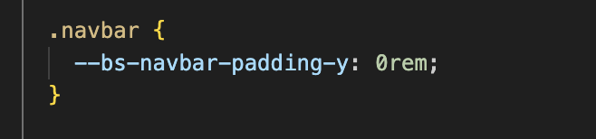

# WK3-Challnge-Code-Bootstrap-Portfolio
Focus on rebuilding portfolio website whilst utilising bootstrap CSS Framework

Made use of the following bootstrap code chunks:
a. Navbar
b. Jumbotron
c. Cards

Main Resources Utilised
i. HTML
ii. CSS

Challenges and Learnings
//It was quite difficult getting my head around the columns and rows concepts. It was also quite tricky getting my head around moving the page title to float over the image and apply some custom design.

Figured out through trial and error how to:

a. Remove white spaces around navbar.

b. Add image headers by using absolute, relative positioning as well as display and background-color.